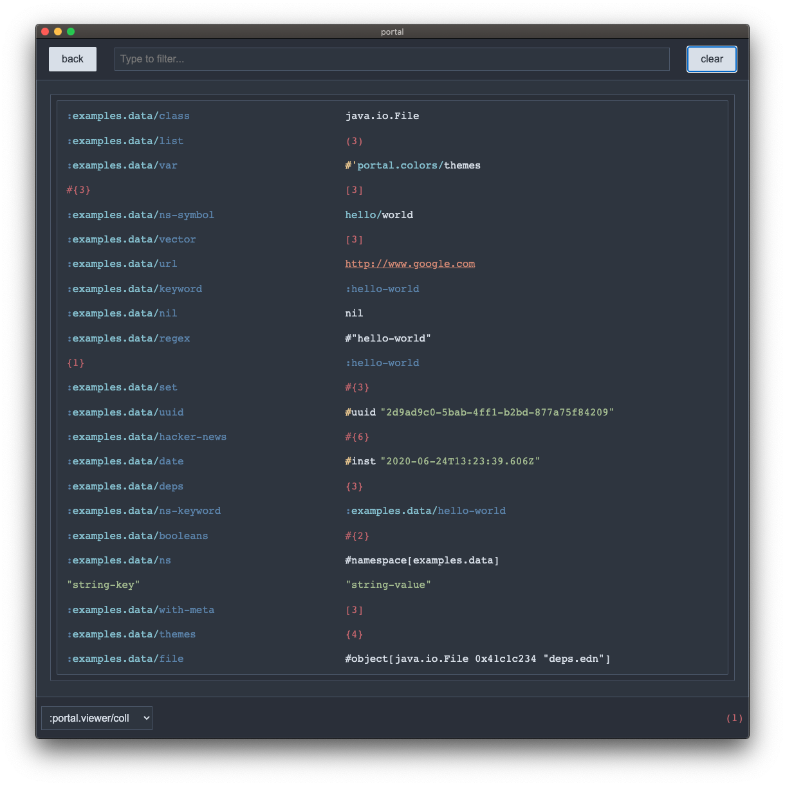

# portal

A clojure tool to browse through your data.

State: alpha, but it mostly works I think



## API Usage

```bash
clj -Sdeps '{:deps {portal {:git/url "https://github.com/djblue/portal.git" :sha "6339a5b2c0cef3df780c053d4eea9253cdca6301"}}}'
```

```clojure
(require '[portal.api :as p])

(p/open) ; Open a new inspector

(p/tap) ; Add portal as a tap> target

(tap> :hello) ; Start tapping out values

(p/clear) ; Clear all values

(tap> :world) ; Tap out more values

(p/close) ; Close the inspector when done
```

## CLI Usage

    cat deps.edn | clojure -m portal.main edn

    cat package.json | clojure -m portal.main json

## Goals

- Support as much of clojure data as possible
- First class support for async extensibility
- Simple standalone usage without a clojure environment
- Easy theming

## Prior Art

- [clojure.inspector](https://clojuredocs.org/clojure.inspector/inspect)
- [REBL](https://github.com/cognitect-labs/REBL-distro)
- [punk](https://github.com/Lokeh/punk)
- [shadow-cljs inspect](https://clojureverse.org/t/introducing-shadow-cljs-inspect/5012)

## Development

    make dev

    :CljEval (shadow/repl :app) - if you are a vimmer

## License

The MIT License (MIT)

Permission is hereby granted, free of charge, to any person obtaining a
copy of this software and associated documentation files (the "Software"),
to deal in the Software without restriction, including without limitation
the rights to use, copy, modify, merge, publish, distribute, sublicense,
and/or sell copies of the Software, and to permit persons to whom the
Software is furnished to do so, subject to the following conditions:

The above copyright notice and this permission notice shall be included in
all copies or substantial portions of the Software.

THE SOFTWARE IS PROVIDED "AS IS", WITHOUT WARRANTY OF ANY KIND, EXPRESS OR
IMPLIED, INCLUDING BUT NOT LIMITED TO THE WARRANTIES OF MERCHANTABILITY,
FITNESS FOR A PARTICULAR PURPOSE AND NONINFRINGEMENT. IN NO EVENT SHALL
THE AUTHORS OR COPYRIGHT HOLDERS BE LIABLE FOR ANY CLAIM, DAMAGES OR OTHER
LIABILITY, WHETHER IN AN ACTION OF CONTRACT, TORT OR OTHERWISE, ARISING
FROM, OUT OF OR IN CONNECTION WITH THE SOFTWARE OR THE USE OR OTHER
DEALINGS IN THE SOFTWARE.
