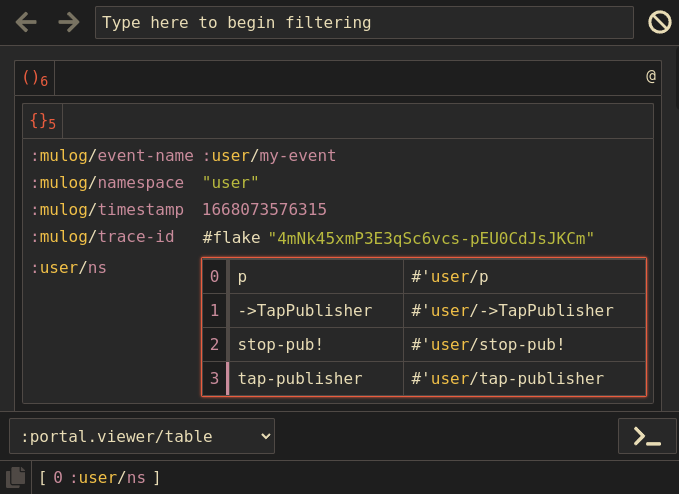

# μ/log Setup Guide

[μ/log](https://github.com/brunobonacci/mulog) logs events as data; Portal
navigates data. Let's have them work together. 🤝



Using Portal to consume system logs is meant for **development** (and perhaps test)
**environments only**.

The μ/log publisher defined below can be used together with other publishers,
by configuring a [μ/log multi publisher](https://github.com/BrunoBonacci/mulog/blob/master/doc/publishers/multi-publisher.md).

## Basic Setup

Let's define a custom μ/log publisher that publishes log events with [`tap>`](https://clojuredocs.org/clojure.core/tap%3E):

```clojure
(ns user
  (:require [com.brunobonacci.mulog :as mu]
            [com.brunobonacci.mulog.buffer :as rb]
            [portal.api :as p]))

(deftype TapPublisher [buffer transform]
  com.brunobonacci.mulog.publisher.PPublisher
  (agent-buffer [_] buffer)

  (publish-delay [_] 200)

  (publish [_ buffer]
    (doseq [item (transform (map second (rb/items buffer)))]
      (tap> item))
    (rb/clear buffer)))

(defn tap-publisher
  [{:keys [transform] :as _config}]
  (TapPublisher. (rb/agent-buffer 10000) (or transform identity)))
```

Next we start μ/log with our custom publisher:

```clojure
(def pub (mu/start-publisher!
           {:type :custom, :fqn-function "user/tap-publisher"}))
```

What about Portal? We just hook it up as a tap, as we normally do, and the
μ/logs will start flowing in.

```clojure
(def p (p/open))
(add-tap #'p/submit)

(mu/log ::my-event ::ns (ns-publics *ns*))
```

Find a working example of this setup [here](https://github.com/djblue/portal/tree/master/examples/mulog).
